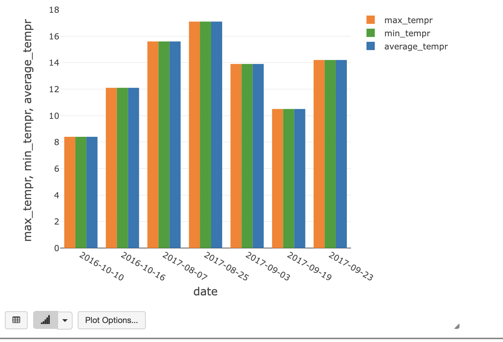

## Deploy infrastructure with terraform

```
terraform init
terraform plan -out terraform.plan
terraform apply terraform.plan
....
terraform destroy
```


 
## Azure Key Vault (Secret Scope):


Create secret scope in Databricks


## Launch notebooks on Databricks cluster
* Create Spark Structured Streaming application with Auto Loader to incrementally and efficiently processes hotel/weather data as it arrives in provisioned Azure ADLS gen2 storage.
* Using Spark calculate in Databricks Notebooks for each city each day:
  1. Number of distinct hotels in the city.
  2. Average/max/min temperature in the city.
* Visualize incoming data in Databricks Notebook for 10 biggest cities (the biggest number of hotels in the city, one chart for one city):
  1. X-axis: date (date of observation).
  2. Y-axis: number of distinct hotels, average/max/min temperature.

1. Bronze stream:

2. Silver stream:

 * Execution plan:
```
== Parsed Logical Plan ==
'Aggregate [window('eventTime, 86400000000, 86400000000, 0) AS window#39925, cast('wthr_date as date) AS date#39926, 'city, 'year, 'month, 'day], [window('eventTime, 86400000000, 86400000000, 0) AS window#39925, cast('wthr_date as date) AS date#39926, 'city, 'year, 'month, 'day, approx_count_distinct('id, 0.05, 0, 0) AS distinct_hotels_counts_by_city#40047, max('avg_tmpr_c) AS max_tempr#40049, min('avg_tmpr_c) AS min_tempr#40051, round(avg('avg_tmpr_c), 2) AS average_tempr#40053]
+- EventTimeWatermark eventTime#39909: timestamp, 1 days
   +- Project [address#39881, avg_tmpr_c#39882, avg_tmpr_f#39883, city#39884, country#39885, geoHash#39886, id#39887, latitude#39888, longitude#39889, name#39890, wthr_date#39891, year#39892, month#39893, day#39894, cast(wthr_date#39891 as timestamp) AS eventTime#39909]
      +- StreamingRelation DataSource(org.apache.spark.sql.SparkSession@6b326bc1,delta,List(),None,List(),None,Map(path -> abfss://data@stm13westeurope.dfs.core.windows.net/data/bronze),None), tahoe, [address#39881, avg_tmpr_c#39882, avg_tmpr_f#39883, city#39884, country#39885, geoHash#39886, id#39887, latitude#39888, longitude#39889, name#39890, wthr_date#39891, year#39892, month#39893, day#39894]

== Analyzed Logical Plan ==
window: struct<start:timestamp,end:timestamp>, date: date, city: string, year: string, month: string, day: string, distinct_hotels_counts_by_city: bigint, max_tempr: double, min_tempr: double, average_tempr: double
Aggregate [window#43012-T86400000ms, cast(wthr_date#39891 as date), city#39884, year#39892, month#39893, day#39894], [window#43012-T86400000ms AS window#39925-T86400000ms, cast(wthr_date#39891 as date) AS date#39926, city#39884, year#39892, month#39893, day#39894, approx_count_distinct(id#39887, 0.05, 0, 0) AS distinct_hotels_counts_by_city#40047L, max(avg_tmpr_c#39882) AS max_tempr#40049, min(avg_tmpr_c#39882) AS min_tempr#40051, round(avg(avg_tmpr_c#39882), 2) AS average_tempr#40053]
+- Filter isnotnull(eventTime#39909-T86400000ms)
   +- Project [named_struct(start, precisetimestampconversion(((((CASE WHEN (cast(CEIL((cast((precisetimestampconversion(eventTime#39909-T86400000ms, TimestampType, LongType) - 0) as double) / cast(86400000000 as double))) as double) = (cast((precisetimestampconversion(eventTime#39909-T86400000ms, TimestampType, LongType) - 0) as double) / cast(86400000000 as double))) THEN (CEIL((cast((precisetimestampconversion(eventTime#39909-T86400000ms, TimestampType, LongType) - 0) as double) / cast(86400000000 as double))) + cast(1 as bigint)) ELSE CEIL((cast((precisetimestampconversion(eventTime#39909-T86400000ms, TimestampType, LongType) - 0) as double) / cast(86400000000 as double))) END + cast(0 as bigint)) - cast(1 as bigint)) * 86400000000) + 0), LongType, TimestampType), end, precisetimestampconversion((((((CASE WHEN (cast(CEIL((cast((precisetimestampconversion(eventTime#39909-T86400000ms, TimestampType, LongType) - 0) as double) / cast(86400000000 as double))) as double) = (cast((precisetimestampconversion(eventTime#39909-T86400000ms, TimestampType, LongType) - 0) as double) / cast(86400000000 as double))) THEN (CEIL((cast((precisetimestampconversion(eventTime#39909-T86400000ms, TimestampType, LongType) - 0) as double) / cast(86400000000 as double))) + cast(1 as bigint)) ELSE CEIL((cast((precisetimestampconversion(eventTime#39909-T86400000ms, TimestampType, LongType) - 0) as double) / cast(86400000000 as double))) END + cast(0 as bigint)) - cast(1 as bigint)) * 86400000000) + 0) + 86400000000), LongType, TimestampType)) AS window#43012-T86400000ms, address#39881, avg_tmpr_c#39882, avg_tmpr_f#39883, city#39884, country#39885, geoHash#39886, id#39887, latitude#39888, longitude#39889, name#39890, wthr_date#39891, year#39892, month#39893, day#39894, eventTime#39909-T86400000ms]
      +- EventTimeWatermark eventTime#39909: timestamp, 1 days
         +- Project [address#39881, avg_tmpr_c#39882, avg_tmpr_f#39883, city#39884, country#39885, geoHash#39886, id#39887, latitude#39888, longitude#39889, name#39890, wthr_date#39891, year#39892, month#39893, day#39894, cast(wthr_date#39891 as timestamp) AS eventTime#39909]
            +- StreamingRelation DataSource(org.apache.spark.sql.SparkSession@6b326bc1,delta,List(),None,List(),None,Map(path -> abfss://data@stm13westeurope.dfs.core.windows.net/data/bronze),None), tahoe, [address#39881, avg_tmpr_c#39882, avg_tmpr_f#39883, city#39884, country#39885, geoHash#39886, id#39887, latitude#39888, longitude#39889, name#39890, wthr_date#39891, year#39892, month#39893, day#39894]

== Optimized Logical Plan ==
Aggregate [window#43012-T86400000ms, _groupingexpression#43117, city#39884, year#39892, month#39893, day#39894], [window#43012-T86400000ms, _groupingexpression#43117 AS date#39926, city#39884, year#39892, month#39893, day#39894, approx_count_distinct(id#39887, 0.05) AS distinct_hotels_counts_by_city#40047L, max(avg_tmpr_c#39882) AS max_tempr#40049, min(avg_tmpr_c#39882) AS min_tempr#40051, round(avg(avg_tmpr_c#39882), 2) AS average_tempr#40053]
+- Project [named_struct(start, precisetimestampconversion(((((CASE WHEN (cast(CEIL((cast((precisetimestampconversion(eventTime#39909-T86400000ms, TimestampType, LongType) - 0) as double) / 8.64E10)) as double) = (cast((precisetimestampconversion(eventTime#39909-T86400000ms, TimestampType, LongType) - 0) as double) / 8.64E10)) THEN (CEIL((cast((precisetimestampconversion(eventTime#39909-T86400000ms, TimestampType, LongType) - 0) as double) / 8.64E10)) + 1) ELSE CEIL((cast((precisetimestampconversion(eventTime#39909-T86400000ms, TimestampType, LongType) - 0) as double) / 8.64E10)) END + 0) - 1) * 86400000000) + 0), LongType, TimestampType), end, precisetimestampconversion(((((CASE WHEN (cast(CEIL((cast((precisetimestampconversion(eventTime#39909-T86400000ms, TimestampType, LongType) - 0) as double) / 8.64E10)) as double) = (cast((precisetimestampconversion(eventTime#39909-T86400000ms, TimestampType, LongType) - 0) as double) / 8.64E10)) THEN (CEIL((cast((precisetimestampconversion(eventTime#39909-T86400000ms, TimestampType, LongType) - 0) as double) / 8.64E10)) + 1) ELSE CEIL((cast((precisetimestampconversion(eventTime#39909-T86400000ms, TimestampType, LongType) - 0) as double) / 8.64E10)) END + 0) - 1) * 86400000000) + 86400000000), LongType, TimestampType)) AS window#43012-T86400000ms, avg_tmpr_c#39882, city#39884, id#39887, year#39892, month#39893, day#39894, cast(wthr_date#39891 as date) AS _groupingexpression#43117]
   +- Filter isnotnull(eventTime#39909-T86400000ms)
      +- EventTimeWatermark eventTime#39909: timestamp, 1 days
         +- Project [avg_tmpr_c#39882, city#39884, id#39887, wthr_date#39891, year#39892, month#39893, day#39894, cast(wthr_date#39891 as timestamp) AS eventTime#39909]
            +- StreamingRelation DataSource(org.apache.spark.sql.SparkSession@6b326bc1,delta,List(),None,List(),None,Map(path -> abfss://data@stm13westeurope.dfs.core.windows.net/data/bronze),None), tahoe, [address#39881, avg_tmpr_c#39882, avg_tmpr_f#39883, city#39884, country#39885, geoHash#39886, id#39887, latitude#39888, longitude#39889, name#39890, wthr_date#39891, year#39892, month#39893, day#39894]

== Physical Plan ==
*(4) HashAggregate(keys=[window#43012-T86400000ms, _groupingexpression#43117, city#39884, year#39892, month#39893, day#39894], functions=[finalmerge_approx_count_distinct(merge buffer#43128) AS approx_count_distinct(id#39887, 0.05)#40046L, finalmerge_max(merge max#43119) AS max(avg_tmpr_c#39882)#40048, finalmerge_min(merge min#43121) AS min(avg_tmpr_c#39882)#40050, finalmerge_avg(merge sum#43124, count#43125L) AS avg(avg_tmpr_c#39882)#40052], output=[window#43012-T86400000ms, date#39926, city#39884, year#39892, month#39893, day#39894, distinct_hotels_counts_by_city#40047L, max_tempr#40049, min_tempr#40051, average_tempr#40053])
+- StateStoreSave [window#43012-T86400000ms, _groupingexpression#43117, city#39884, year#39892, month#39893, day#39894], state info [ checkpoint = <unknown>, runId = 39662b39-c8aa-4c2b-a614-a5ca75a1b879, opId = 0, ver = 0, numPartitions = 200], Append, 0, 2
   +- *(3) HashAggregate(keys=[window#43012-T86400000ms, _groupingexpression#43117, city#39884, year#39892, month#39893, day#39894], functions=[merge_approx_count_distinct(merge buffer#43128) AS buffer#43128, merge_max(merge max#43119) AS max#43119, merge_min(merge min#43121) AS min#43121, merge_avg(merge sum#43124, count#43125L) AS (sum#43124, count#43125L)], output=[window#43012-T86400000ms, _groupingexpression#43117, city#39884, year#39892, month#39893, day#39894, buffer#43128, max#43119, min#43121, sum#43124, count#43125L])
      +- StateStoreRestore [window#43012-T86400000ms, _groupingexpression#43117, city#39884, year#39892, month#39893, day#39894], state info [ checkpoint = <unknown>, runId = 39662b39-c8aa-4c2b-a614-a5ca75a1b879, opId = 0, ver = 0, numPartitions = 200], 2
         +- *(2) HashAggregate(keys=[window#43012-T86400000ms, _groupingexpression#43117, city#39884, year#39892, month#39893, day#39894], functions=[merge_approx_count_distinct(merge buffer#43128) AS buffer#43128, merge_max(merge max#43119) AS max#43119, merge_min(merge min#43121) AS min#43121, merge_avg(merge sum#43124, count#43125L) AS (sum#43124, count#43125L)], output=[window#43012-T86400000ms, _groupingexpression#43117, city#39884, year#39892, month#39893, day#39894, buffer#43128, max#43119, min#43121, sum#43124, count#43125L])
            +- Exchange hashpartitioning(window#43012-T86400000ms, _groupingexpression#43117, city#39884, year#39892, month#39893, day#39894, 200), ENSURE_REQUIREMENTS, [id=#24180]
               +- *(1) HashAggregate(keys=[window#43012-T86400000ms, _groupingexpression#43117, city#39884, year#39892, month#39893, day#39894], functions=[partial_approx_count_distinct(id#39887, 0.05) AS buffer#43128, partial_max(avg_tmpr_c#39882) AS max#43119, partial_min(avg_tmpr_c#39882) AS min#43121, partial_avg(avg_tmpr_c#39882) AS (sum#43124, count#43125L)], output=[window#43012-T86400000ms, _groupingexpression#43117, city#39884, year#39892, month#39893, day#39894, buffer#43128, max#43119, min#43121, sum#43124, count#43125L])
                  +- *(1) Project [named_struct(start, precisetimestampconversion(((((CASE WHEN (cast(CEIL((cast((precisetimestampconversion(eventTime#39909-T86400000ms, TimestampType, LongType) - 0) as double) / 8.64E10)) as double) = (cast((precisetimestampconversion(eventTime#39909-T86400000ms, TimestampType, LongType) - 0) as double) / 8.64E10)) THEN (CEIL((cast((precisetimestampconversion(eventTime#39909-T86400000ms, TimestampType, LongType) - 0) as double) / 8.64E10)) + 1) ELSE CEIL((cast((precisetimestampconversion(eventTime#39909-T86400000ms, TimestampType, LongType) - 0) as double) / 8.64E10)) END + 0) - 1) * 86400000000) + 0), LongType, TimestampType), end, precisetimestampconversion(((((CASE WHEN (cast(CEIL((cast((precisetimestampconversion(eventTime#39909-T86400000ms, TimestampType, LongType) - 0) as double) / 8.64E10)) as double) = (cast((precisetimestampconversion(eventTime#39909-T86400000ms, TimestampType, LongType) - 0) as double) / 8.64E10)) THEN (CEIL((cast((precisetimestampconversion(eventTime#39909-T86400000ms, TimestampType, LongType) - 0) as double) / 8.64E10)) + 1) ELSE CEIL((cast((precisetimestampconversion(eventTime#39909-T86400000ms, TimestampType, LongType) - 0) as double) / 8.64E10)) END + 0) - 1) * 86400000000) + 86400000000), LongType, TimestampType)) AS window#43012-T86400000ms, avg_tmpr_c#39882, city#39884, id#39887, year#39892, month#39893, day#39894, cast(wthr_date#39891 as date) AS _groupingexpression#43117]
                     +- *(1) Filter isnotnull(eventTime#39909-T86400000ms)
                        +- *(1) EventTimeWatermark eventTime#39909: timestamp, 1 days
                           +- *(1) Project [avg_tmpr_c#39882, city#39884, id#39887, wthr_date#39891, year#39892, month#39893, day#39894, cast(wthr_date#39891 as timestamp) AS eventTime#39909]
                              +- StreamingRelation tahoe, [address#39881, avg_tmpr_c#39882, avg_tmpr_f#39883, city#39884, country#39885, geoHash#39886, id#39887, latitude#39888, longitude#39889, name#39890, wthr_date#39891, year#39892, month#39893, day#39894]
```
3. Gold Stream:
 * Number of distinct hotels in the city:
 

  
 * Execution plan:
```
== Parsed Logical Plan ==
GlobalLimit 10
+- LocalLimit 10
   +- Window [city#43137, hotel_count#43166L, row_number() windowspecdefinition(hotel_count#43166L DESC NULLS LAST, specifiedwindowframe(RowFrame, unboundedpreceding$(), currentrow$())) AS rank#43170], [hotel_count#43166L DESC NULLS LAST]
      +- Project [city#43137, hotel_count#43166L]
         +- Sort [hotel_count#43166L DESC NULLS LAST], true
            +- Aggregate [city#43137], [city#43137, max(distinct_hotels_counts_by_city#43141L) AS hotel_count#43166L]
               +- Relation[window#43135-T86400000ms,date#43136,city#43137,year#43138,month#43139,day#43140,distinct_hotels_counts_by_city#43141L,max_tempr#43142,min_tempr#43143,average_tempr#43144] parquet

== Analyzed Logical Plan ==
city: string, hotel_count: bigint, rank: int
GlobalLimit 10
+- LocalLimit 10
   +- Window [city#43137, hotel_count#43166L, row_number() windowspecdefinition(hotel_count#43166L DESC NULLS LAST, specifiedwindowframe(RowFrame, unboundedpreceding$(), currentrow$())) AS rank#43170], [hotel_count#43166L DESC NULLS LAST]
      +- Project [city#43137, hotel_count#43166L]
         +- Sort [hotel_count#43166L DESC NULLS LAST], true
            +- Aggregate [city#43137], [city#43137, max(distinct_hotels_counts_by_city#43141L) AS hotel_count#43166L]
               +- Relation[window#43135-T86400000ms,date#43136,city#43137,year#43138,month#43139,day#43140,distinct_hotels_counts_by_city#43141L,max_tempr#43142,min_tempr#43143,average_tempr#43144] parquet

== Optimized Logical Plan ==
GlobalLimit 10
+- LocalLimit 10
   +- Window [city#43137, hotel_count#43166L, row_number() windowspecdefinition(hotel_count#43166L DESC NULLS LAST, specifiedwindowframe(RowFrame, unboundedpreceding$(), currentrow$())) AS rank#43170], [hotel_count#43166L DESC NULLS LAST]
      +- Sort [hotel_count#43166L DESC NULLS LAST], true
         +- Aggregate [city#43137], [city#43137, max(distinct_hotels_counts_by_city#43141L) AS hotel_count#43166L]
            +- Project [city#43137, distinct_hotels_counts_by_city#43141L]
               +- Relation[window#43135-T86400000ms,date#43136,city#43137,year#43138,month#43139,day#43140,distinct_hotels_counts_by_city#43141L,max_tempr#43142,min_tempr#43143,average_tempr#43144] parquet

== Physical Plan ==
AdaptiveSparkPlan isFinalPlan=false
+- GlobalLimit 10
   +- LocalLimit 10
      +- Window [city#43137, hotel_count#43166L, row_number() windowspecdefinition(hotel_count#43166L DESC NULLS LAST, specifiedwindowframe(RowFrame, unboundedpreceding$(), currentrow$())) AS rank#43170], [hotel_count#43166L DESC NULLS LAST], 10
         +- Sort [hotel_count#43166L DESC NULLS LAST], false, 0
            +- Exchange SinglePartition, ENSURE_REQUIREMENTS, [id=#24251]
               +- Sort [hotel_count#43166L DESC NULLS LAST], true, 0
                  +- Exchange rangepartitioning(hotel_count#43166L DESC NULLS LAST, 200), ENSURE_REQUIREMENTS, [id=#24248]
                     +- HashAggregate(keys=[city#43137], functions=[finalmerge_max(merge max#43175L) AS max(distinct_hotels_counts_by_city#43141L)#43165L], output=[city#43137, hotel_count#43166L])
                        +- Exchange hashpartitioning(city#43137, 200), ENSURE_REQUIREMENTS, [id=#24245]
                           +- HashAggregate(keys=[city#43137], functions=[partial_max(distinct_hotels_counts_by_city#43141L) AS max#43175L], output=[city#43137, max#43175L])
                              +- FileScan parquet [city#43137,distinct_hotels_counts_by_city#43141L] Batched: true, DataFilters: [], Format: Parquet, Location: PreparedDeltaFileIndex[abfss://data@stm13westeurope.dfs.core.windows.net/data/silver], PartitionFilters: [], PushedFilters: [], ReadSchema: struct<city:string,distinct_hotels_counts_by_city:bigint>
```
* Average/max/min temperature in the city:
1. Paris


2. London


3. Barcelona


4. Milan


5. Amsterdam


6. Paddington



7. San Diego


8. New York


9. Memphis


10. Houston


